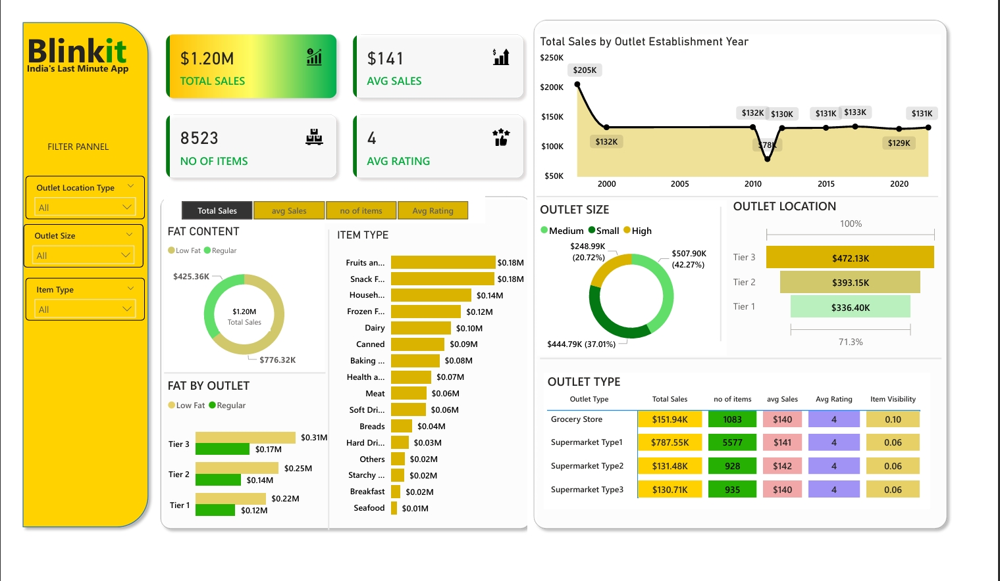

Blinkit Sales Dashboard

Tools Used

- Power BI

Project Overview

This project analyzes Blinkit sales data using Power BI to identify trends, top-performing products, and key business insights.

Dashboard Preview

Key Insights

- Identified top-selling categories
- Analyzed monthly sales trends
- Observed revenue distribution patterns

Files

- blinkit_dashboard.pbix
- blinkit_dashboard.pdf
